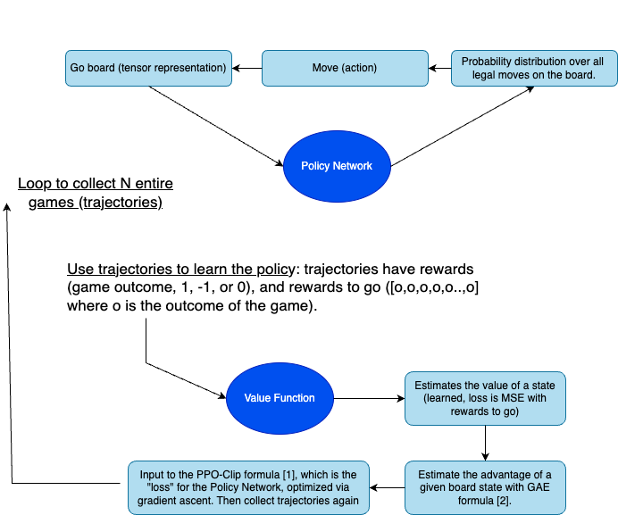

# Teaching an agent the game of Go with Proximal Policy Optimization (PPO)
Inspired by AlphaGo Zero and nanoGPT, this is a minimalistic implementation for teaching a neural net to play the game of Go purely through self-play (chinese rules). No training on human games is involved, as this is deemed more elegant.

The code for PPO is kept readable to make things intuitive, sticking as close as possible to [J. Schulman's pseudo-code](https://spinningup.openai.com/en/latest/algorithms/ppo.html#pseudocode).

```python
def ppo_train(policy_net, value_net, n_loops):
    policy_opt, value_opt = setup_optimizers(policy_net, value_net)
    for _ in tqdm(range(n_loops), desc="PPO Steps"):
        trajectories = collect_trajectories(policy_net, n_trajectories)
        add_rewards_to_go_to_trajectories(trajectories)
        advantages = compute_advantages(trajectories, value_net)
        update_policy(policy_net, policy_opt, trajectories, advantages)
        update_value_function(value_net, value_opt, trajectories)
```



# References
[1] Schulman et al. "Proximal Policy Optimization Algorithms", arxiv:1707.06347, 2017.

[2] Schulman et al. "High-Dimensional Continuous Control Using Generalized
Advantage Estimation", arxiv:1506.02438, 2015.


# License
This project is licensed under the MIT [LICENSE](LICENSE) - see the LICENSE file for
details.
